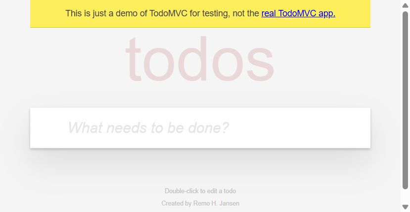
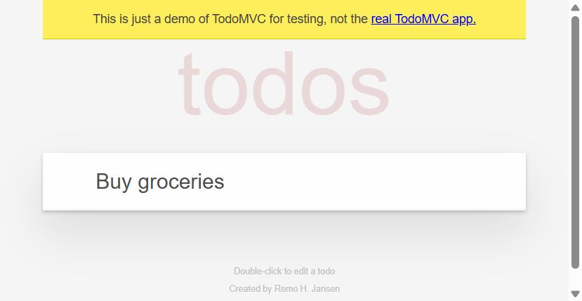
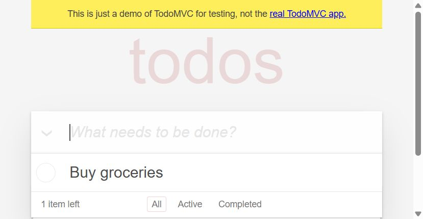
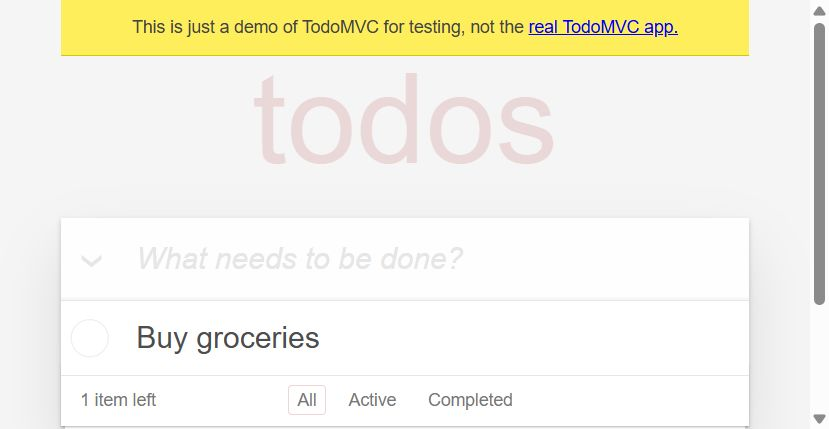

# Session Report — TodoMVC / Create Task
**Date:** 2026-06-08  
**Agent:** GitHub Copilot (Agent mode) + MCP Playwright + MCP Jira  
**Target:** https://demo.playwright.dev/todomvc  
**Feature tested:** Create a task  
**Jira project:** SCRUM  

---

## Verdict: PASS

All steps completed successfully. No defect detected. No Jira ticket created.

---

## Agent trace

    [AGENT] Read .github/instructions/qa-mcp-agent.instructions.md
    [AGENT] Read .github/prompts/explore-and-report.prompt.md
    [AGENT] Starting browser session

    [MCP:playwright] browser_navigate → https://demo.playwright.dev/todomvc
    [MCP:playwright] browser_screenshot → screenshot-01-initial.png
    [AGENT] Page loaded. Input placeholder: "What needs to be done?"

    [AGENT] Step 1 — Fill the task input
    [MCP:playwright] browser_fill → selector=".new-todo", value="Buy groceries"
    [MCP:playwright] browser_screenshot → screenshot-02-filled.png
    [AGENT] Input field contains exact typed text

    [AGENT] Step 2 — Submit the task (Enter key)
    [MCP:playwright] browser_key_press → key="Enter"
    [MCP:playwright] browser_screenshot → screenshot-03-submitted.png
    [AGENT] New todo row appeared. Footer: "1 item left"

    [AGENT] Step 3 — Verify DOM state programmatically
    [MCP:playwright] page.evaluate →
      const items = Array.from(document.querySelectorAll('.todo-list li .view label'))
                        .map(el => el.textContent?.trim());
      const count = document.querySelectorAll('.todo-list li').length;
      const hasBuyGroceries = items.includes('Buy groceries');
      return { count, items, hasBuyGroceries };
    → result: { count: 1, items: ["Buy groceries"], hasBuyGroceries: true }
    [MCP:playwright] browser_screenshot → screenshot-04-verified.png

    [AGENT] Assertion: item count = 1 → OK
    [AGENT] Assertion: label = "Buy groceries" → OK
    [AGENT] Assertion: hasBuyGroceries = true → OK

    [AGENT] All assertions passed. Feature "Create a task" is FUNCTIONAL.
    [AGENT] No defect detected → Jira ticket creation skipped.

---

## Screenshots

| Step | File | Description |
|------|------|-------------|
| 1 |  | Page loaded, empty input |
| 2 |  | Input filled with "Buy groceries" |
| 3 |  | Task visible in list, footer "1 item left" |
| 4 |  | DOM assertion confirmed |

---

## Environment

| Parameter | Value |
|-----------|-------|
| MCP Playwright | `@playwright/mcp@latest` · 23 tools |
| MCP Jira | `jira-mcp` · 2 tools |
| Browser | Chromium (MCP managed) |
| VS Code Copilot | Agent mode |
| Node.js | 18+ |